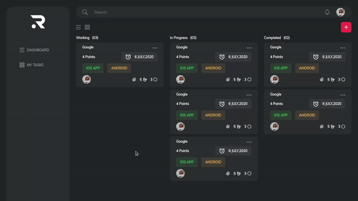
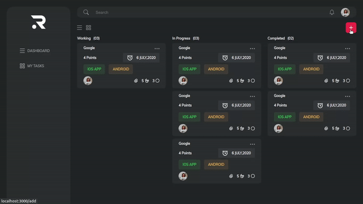
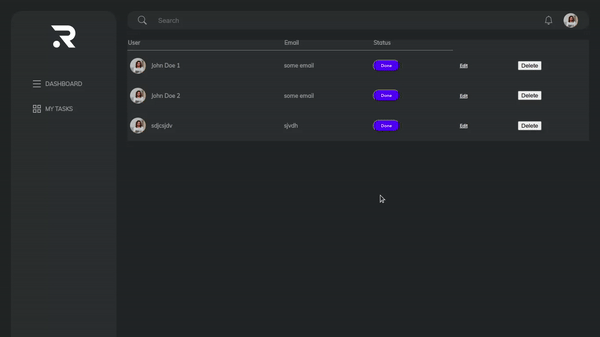

# ✨ _Hi there!_  ✨

## My project with Create React App

In the project directory, you can run:

`npm start`

Runs the app in the development mode.\
Open [http://localhost:3000](http://localhost:3000) to view it in your browser.

## Screenshots

## Technologies
- React
- Context API
- Webpack

> I was working with graphql but no success in the backend 😶‍🌫️

